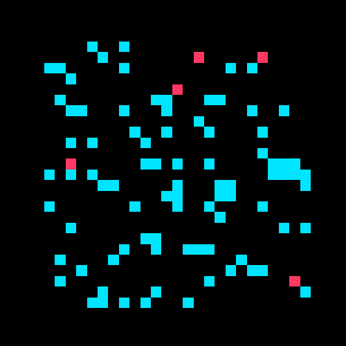

## BMI 500 — HW 2: Agent-Based Modeling of Pandemic Spread

- **Name/Contact**: Your Name — your.email@example.com
- **Question answered**: HW 2 — Agent-Based Modeling of Pandemic Spread (A and B)
- **Repository structure (enumerated by parts)**:
  - `HW2.py` — Part A (base model) and Part B (social distancing) implementation
  - `HW2_ABM.ipynb` — Reproducible notebook generating figures and tables
  - `figs/` — Saved plots (created when running the notebook)
  - `requirements.txt` — Minimal Python dependencies

### Quick start
```bash
python -m venv .venv && source .venv/bin/activate
pip install -r requirements.txt
python HW2.py  # quick demo run with plots
```
Or open `HW2_ABM.ipynb` and run all cells to regenerate figures into `figs/`.

### Methods (concise)
- Grid: 75×75 bounded lattice; 100 agents with states S/I/R.
- Movement: random cardinal step (or stay if `move_prob<1`); optional avoidance bias.
- Transmission: susceptible becomes infected with probability `p` if sharing a cell with any infected.
- Recovery: infected recovers with probability `q` per step.
- Social distancing: reduce `move_prob`; avoidance bias via `avoidance` in movement choice.
- Runs: 200 steps; sensitivity over `p∈{0.05,0.1}`, `q∈{0.02,0.05}`; multi-seed averaging.

### Key insights
- Lower movement (`move_prob↓`) and higher avoidance (`avoidance↑`) reduce and delay the infection peak.
- Higher infection probability `p` increases peak and speeds time-to-peak; higher recovery `q` shortens outbreak tail.
- With sparse agents on a large grid, cell-sharing events are rare; results may show minimal spread unless interaction density rises (e.g., via smaller grids or neighborhood infection).

### Comparative model performance (No distancing vs With distancing)
- Peak infected: lower with distancing; timing delayed.
- Final recovered: generally lower with distancing when spread is curtailed.
- Duration: distancing often lengthens time-to-peak but limits maximum burden (relevant for healthcare capacity).

### Relevance to model-based ML
- Mechanistic, state-based agent rules form an interpretable generative model of dynamics.
- Parameter sweeps (p,q, movement, avoidance) enable model calibration and sensitivity assessment akin to hyperparameter studies.
- Averaging over seeds approximates expected behavior, reducing variance for analysis/comparison.

### Suggestions for future improvements
- Increase contact opportunities (e.g., Moore neighborhood infection radius) or reduce grid size to study richer dynamics.
- Heterogeneous agents (age/risk), location “hotspots,” or mobility networks.
- Time-varying policies (adaptive `move_prob`/`avoidance`) and vaccination.
- Inference: estimate `p,q` (and policy parameters) from synthetic/real data via likelihood-free or ABC methods.

### How each part maps to code
- Part A — Base model: `SimCfg`, `run_sim`, `plot_curves`, `sweep` in `HW2.py`.
- Part B — Social distancing: `move_prob` and `avoidance` fields in `SimCfg`; examples in `demo()` and notebook.

### Figures
Run `HW2_ABM.ipynb` to save figures in `figs/`:
- `figs/base_single.png` — Single-run S/I/R
- `figs/avg_random_inits.png` — Averages across seeds
- `figs/sensitivity_table.txt` — Tabular summary (p, q, peak, t_peak, final_R)
- `figs/distancing_compare.png` — No distancing vs distancing (averages)

### AI tool disclosure
This repository was authored with assistance from an AI coding assistant for code edits and documentation organization.

### References
- Python docs and scientific stack (`numpy`, `matplotlib`).
- Standard agent-based epidemic modeling literature (cellular automata, random walks, SIR dynamics).


